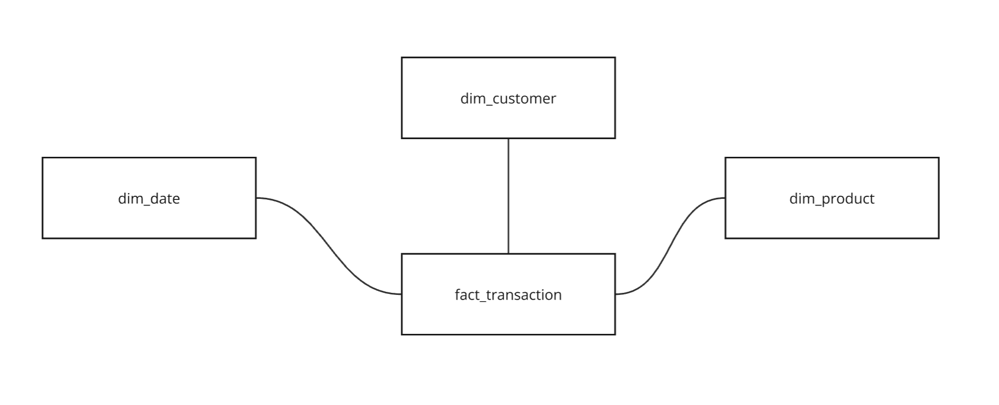
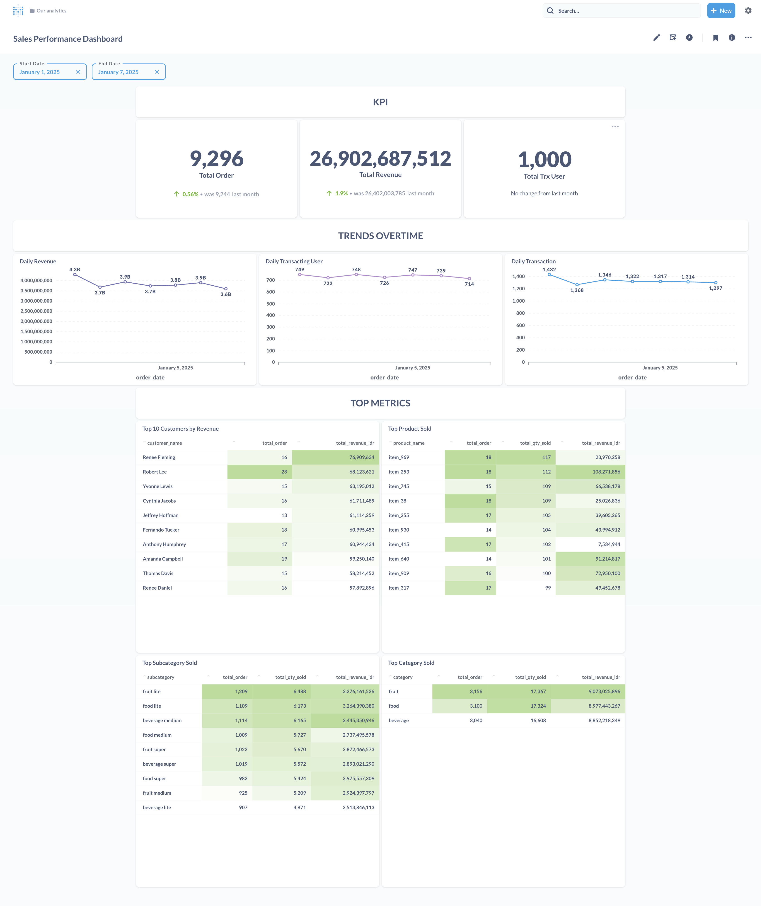

# Analytics-Ready Data Mart

This project showcases the creation of an analytics-ready data mart for an e-commerce platform. It demonstrates dimensional modeling, advanced SQL, and performance optimization to answer key business questions.

---

## Key Features

- **Star Schema Design**:
  - **Fact Table**: `fact_transaction`
  - **Dimension Tables**: `dim_product`, `dim_customer`, `dim_date`
- **Business Insights**:
  - KPI
    - Total Order
    - Total Revenue
    - Total Transacting User
  - Trends
    - Daily Order
    - Daily Revenue
    - Daily Transacting User
  - Top Customers
  - Top Product
  - Top Category
  - Top Subcategory

---

## Tech Stack

- **PostgreSQL** (Database)
- **Docker** (Containerization)
- **Python** (Data generation & ingestion)
- **SQLAlchemy** (Database interaction)
- **SQL** (Data Retrieval)

---

## Steps

1. **Set Up Tools**:  
   Use Docker to start PostgreSQL and Metabase.  
   ```bash
   docker-compose up -d
   ```
2. **Generate Synthetic Data**:
   Use Python's Faker to create datasets for sales, products, customers, and inventory.

3. **Ingest Data**:
   Load raw data into PostgreSQL using SQLAlchemy's `to_sql`.

4. **Create Star Schema**:
   Transform raw data into analytics-ready fact and dimension tables.

5. **Run Queries**:
   Analyze data with SQL to answer business questions.

6. **Visualization**:
   Visualize analysis in a dashboard.

<br/>

Example Query to get Top Customers by Revenue:
```bash
SELECT 
    customer_id, 
    SUM(revenue) AS total_revenue
FROM analytics.fact_transaction
GROUP BY customer_id
ORDER BY total_revenue DESC
LIMIT 10;
```

## Results

### Warehouse Schema
   

### Dashboard
   